# Metal forming monitoring system with the use of a graphene sensor 

An experimental engineering project focused on the development and validation of a vibration monitoring system, combining materials engineering with electronics.
Tests were conducted both in home and laboratory environments, with supervision over the proper selection of plastic processing parameters.
This document describes the system architecture, hardware design, embedded software implementation, experimental validation, and testing methodology.

## General Information

This project was developed to analyze vibration response characteristics of a custom-prepared material mixture.

The primary goal was to design and validate a measurement system based on a graphene sensor capable of:

- Capturing vibration signals in real time
- Evaluating material response under mechanical excitation
- Verifying system performance using graphical data analysis

The laboratory material mixture was originally developed by Conor S. Boland, Umar Khan, and Gavin Ryan in their work *"Sensitive electromechanical sensors using viscoelastic graphene-polymer nanocomposites"* (Science, 2016). 

For this project, I focused on a simplified version of this mixture, following the instructions from [Instructables: Goophene Hypersensitive Graphene Sensors](https://www.instructables.com/Goophene-Hypersensitive-Graphene-Sensors/).

## Built With

### Hardware
- Arduino Uno – Microcontroller platform
- MCP 3424 18-bit 4-channel I2C ADC converter
- Custom Material Composite – Experimental test specimen (Graphene/Silly Putty) 
- Resistors of various values (1 kΩ and 1.5 kΩ)
- Other basic electronic components, including wires and a breadboard

### Software
- Arduino (C++)
- Telemetry Viewer

## Material Formulation & Preparation

1. In a plastic container, a sample of Silly Putty was mixed with acetone for approximately 10 minutes, then left to dry for 15–30 minutes.
2. In a separate container, flake graphene (rGO) was combined with acetone to form a uniform black paste.
3. The dried putty was added to the graphene–acetone mixture and stirred first with a stick, then subjected to mechanical vibration for 20 minutes.
4. The resulting mixture was left to evaporate in an open room for several hours.
5. The mixture was lightly sprayed with a small amount of silicone oil.
6. Samples were shaped and formed.

The mixing process was repeated several times, producing multiple samples with varying resistance depending on the proportions and quality of the mixing. The first sample had a resistance of approximately 500 Ω, while the best-performing sample reached a minimum of 120 Ω.

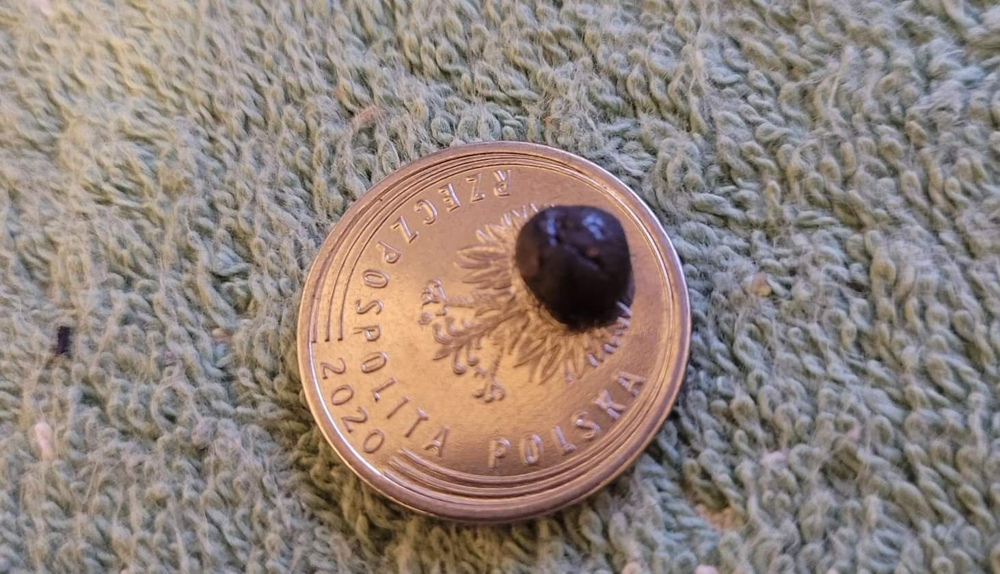

<em>Figure 1: First sample prepared with graphene mixture.</em>

## Electronic System Design

<em>Figure 2: Circuit diagram.</em>

## Firmware Implementation

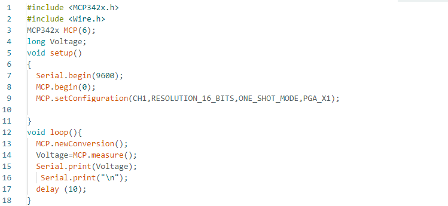

<em>Figure 3: Arduino code.</em>

## Experimental Validation & Results

Preliminary tests (home environment):
The sensor’s response to table taps was examined. Voltage initially stabilized around 1.17 V, then spiked with each tap, returning to baseline afterward. The strongest tap slightly shifted the stabilization voltage (see Chart 1).
In a second test, a small object (insulating tape) was dropped from 20 cm above the sensor. Higher drop heights produced larger voltage spikes, with stronger disturbances than finger taps (see Chart 2).

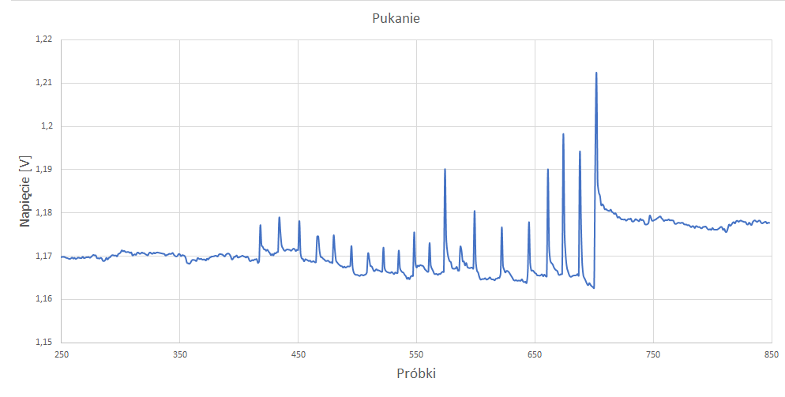

<em>Chart 1: Voltage response to table taps.</em>

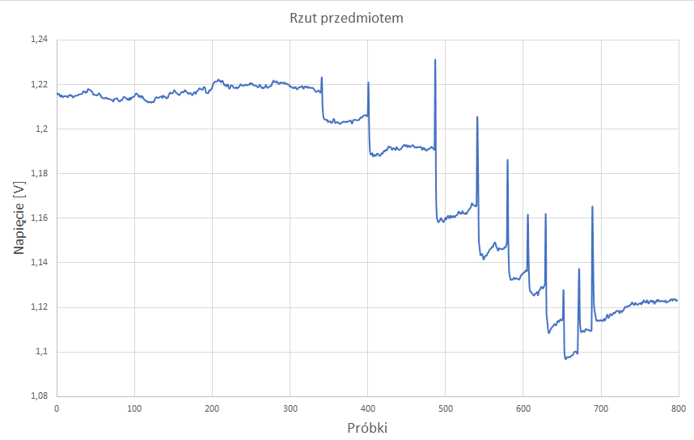

<em>Chart 2: Voltage response to insulating tape drops.</em>

Laboratory tests:
Several configurations were tested. In the first setup, the graphene sensor was placed on a table partly supporting a metal plate inside the machine. Vibrations from the punching process were clearly detected.

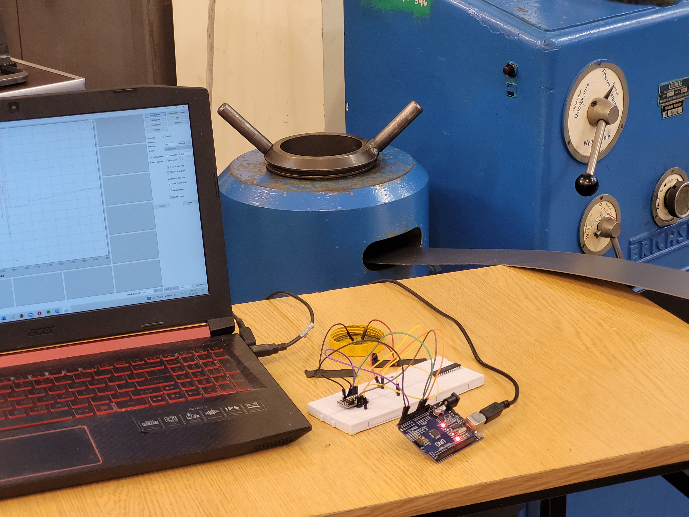

<em>Figure 4: First configuration. (Punching)</em>

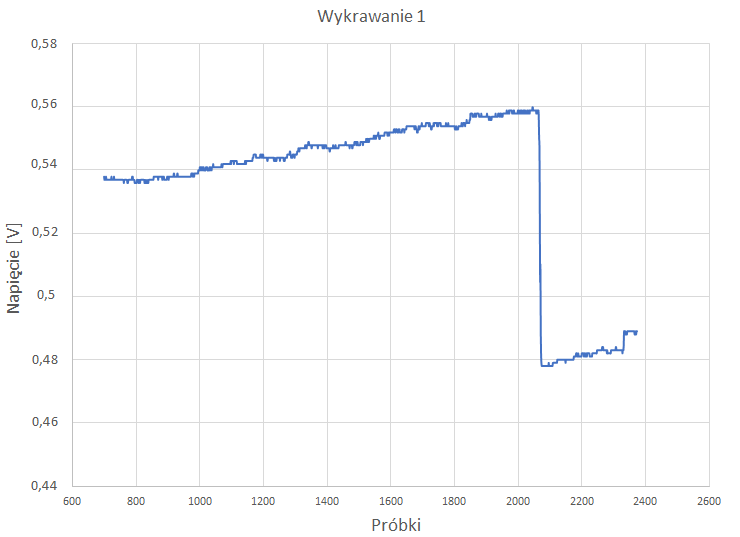

<em>Chart 3: First test.</em>

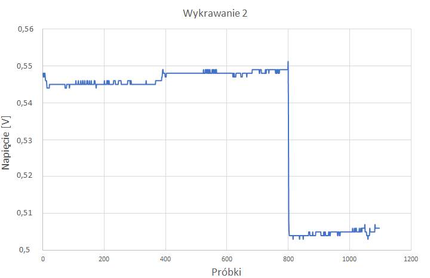

<em>Chart 4: Second test.</em>

In the next setup, the sensor was mounted on a matrix, allowing more controlled measurements during the stamping process.
Direct placement of the sensor closer to the source was not possible due to the machine’s construction.

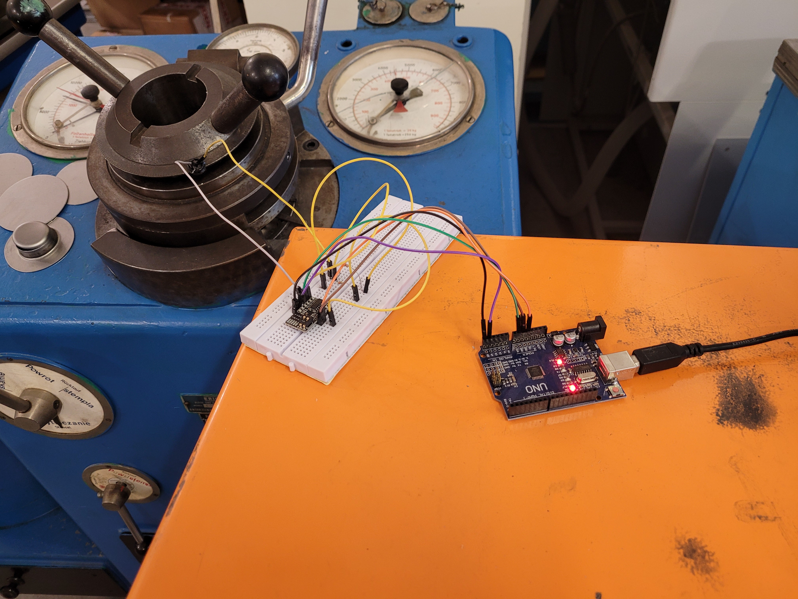

<em>Figure 5: Second configuration. (Stamping)</em>

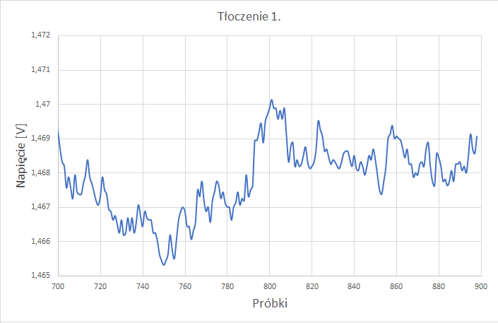

<em>Chart 5: Third test – low visibility of peaks.</em>

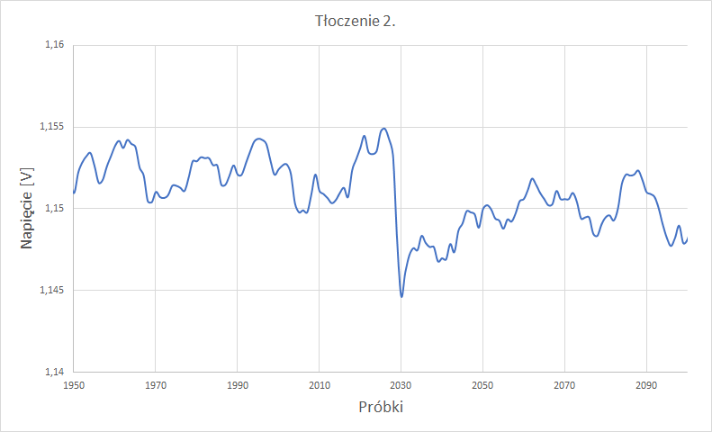

<em>Chart 6: Fourth test.</em>

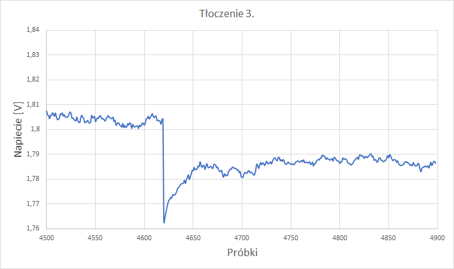

<em>Chart 6: Fifth test.</em>

## Summary / Conclusions
The presented measurements demonstrate the potential of the graphene sensor for monitoring plastic deformation processes, as well as other applications. Even preliminary home tests provided sufficient data to draw meaningful conclusions.

Key observations:
Sample preparation affects sensor performance. Variations in mixture ratios, molecular bonding, and the elasticity of the material influence resistance and durability. Early samples could crumble, while later ones balanced elasticity and sensitivity.

The monitoring system proved effective but requires improvements, including secure mounting, optimized sensor placement, and attention to peripheral components such as wiring. Long, thin, rigid wires significantly reduce signal quality.

Using a voltage divider allows control over signal levels, but proper resistor selection is critical to minimize noise from external sources.

The project contributed to learning across multiple disciplines: microcontrollers, materials science, and chemistry, highlighting the interdisciplinary nature of developing novel sensor systems.

Overall, the results indicate that graphene-based sensors can be applied in a variety of fields, but careful design, sample preparation, and system integration are essential for reliable performance.

## Authors

[Daniel Swyst] – System design, material preparation, firmware implementation, testing

## Credits

Conor S. Boland, Umar Khan, and Gavin Ryan, Sensitive electromechanical sensors using viscoelastic graphene-polymer nanocomposites, Science, 2016.

[Simplified mixture and methodology adapted from Goophene Hypersensitive Graphene Sensors](https://www.instructables.com/Goophene-Hypersensitive-Graphene-Sensors/)
